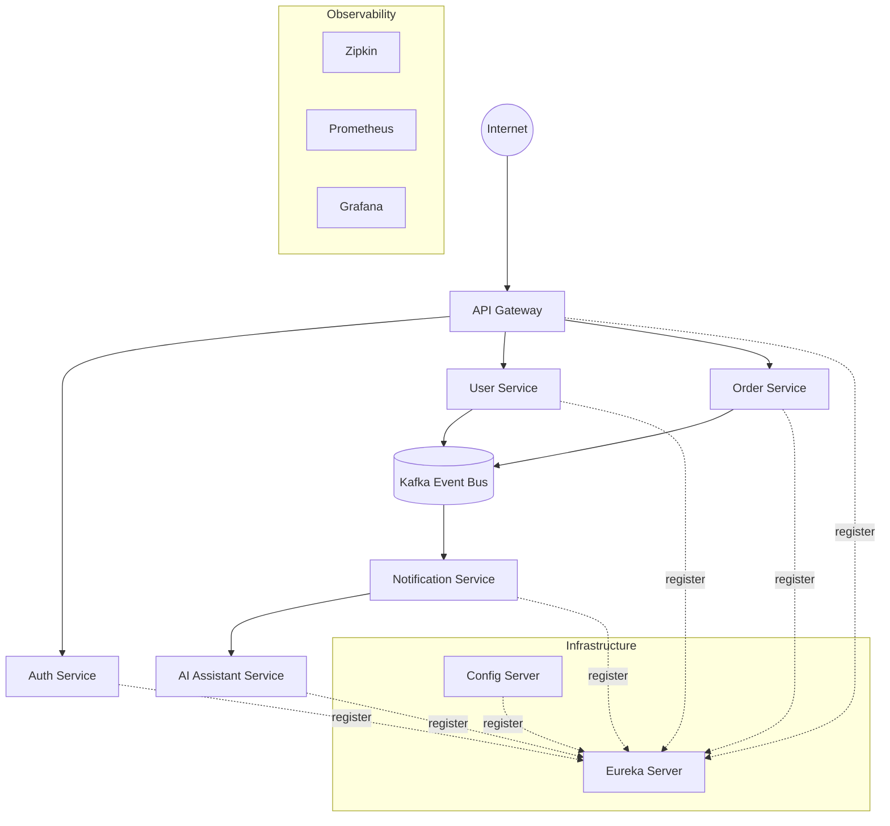

## Platform Architecture

### High-level diagram

### Notes

- **Service discovery**: `infrastructure/eureka-server`
- **Central configuration**: `infrastructure/config-server` reads configs from `infrastructure/config-repo`
- **Routing**: `infrastructure/api-gateway`
- **Messaging**: Kafka stack is defined in `deployment/docker/docker-compose.yml`
- **AI service**: `services/ai-assistant-service` is currently a stub and is intended to be upgraded to Spring AI + Ollama.

